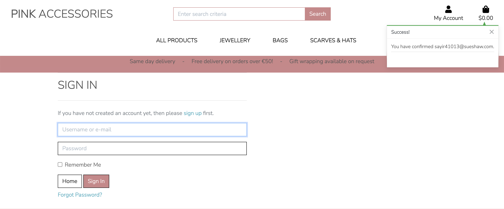
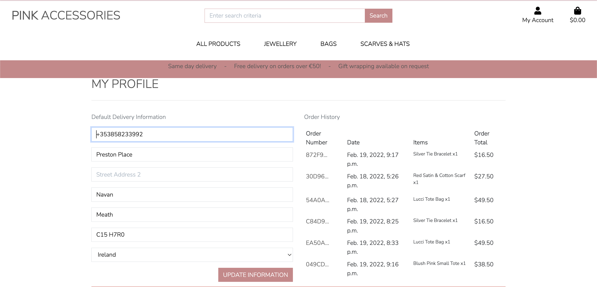

# Pink Accessories
'Pink Accessories' is a fabulous ecommerce website allowing users purchase jewellery, bags hats and scarves developed for developed for Milestone 5 project 5 as part of the Code Institute - Diploma in Software Development (Full stack) course.

There are two types of users, and I have set up accounts for both
* An admin(administrator) user account has been set up with username/password of admin/Password1@
* A regular(shopper) user account has been set up with username/password of (Add login for shopper)
* When making a payment as a regular user, a test credit card of 4242424242424242 has been set up for the card number.
* For the expiry date, cvc and postal code any series number(s) can be used(once they meet the mimimum values).

**View the live site [here](https://ci-ms5-pinkaccessories.herokuapp.com/)**
<br><br>
<br>

# Table of Contents
- [Pink Accessories](#pink-accessories)
- [Project Overview](#project-overview)
- [UX](#ux)
  * [Strategy](#strategy)
  * [Structure](#structure)
    + [Website pages](#website-pages)
    + [Code Structure](#code-structure)
    + [Database](#database)
      - [Models](#models)
        * [User Model](#user-model)
        * [Order Model](#order-model)
        * [OrderLineItem Model](#orderlineitem-model)
        * [Product Model](#product-model)
        * [Category Model](#category-model)
  * [Scope](#scope)
    + [User Stories Potential or Existing Customer](#user-stories-potential-or-existing-customer)
    + [User Stories Website Owner](#user-stories-website-owner)
  * [Skeleton](#skeleton)
    + [Wireframes](#wireframes)
  * [Surface](#surface)
    + [Color Palette](#color-palette)
    + [Typography](#typography)
- [Features](#features)
  * [Existing Features](#existing-features)
    + [Feature 1 Navigation Bar and Homepage](#feature-1-navigation-bar-and-homepage)
      - [Description feature 1](#description-feature-1)
      - [User Stories feature 1](#user-stories-feature-1)
    + [Feature 2 Footer](#feature-2-footer)
      - [Description feature 2](#description-feature-2)
      - [User Stories feature 2](#user-stories-feature-2)
    + [Feature 3 Register](#feature-3-register)
      - [Description feature 3](#description-feature-3)
      - [User Stories feature 3](#user-stories-feature-3)
    + [Feature 4 Login](#feature-4-login)
      - [Description & User Stroies feature 4](#description-feature-4)
    + [Feature 5 Products and Product Detail Pages](#feature-5-products-and-product-detail-pages)
      - [Description & User Storesfeature 5](#description-feature-5)
    + [Feature 6 Profile Page](#feature-6-profile-page)
      - [Description & User Stories feature 6](#description-feature-6)
    + [Feature 7 Product Management](#feature-7-product-management)
      - [Description & User Stories feature 7](#description-feature-7)
    + [Feature 8 Bag and Checkout](#feature-8-bag-and-checkout)
      - [Description & User Stories feature 8](#description-feature-8)
    + [Feature 9 Admin](#feature-9-admin)
      - [Description & User Stories feature 13](#description-feature-9)
- [Technologies Used](#technologies-used)
  * [Languages](#languages)
  * [Libraries and other resources](#libraries-and-other-resources)
- [Testing](#testing)
- [APIs and configuration](#apis-and-configuration)
  * [Google emails](#google-emails)
  * [Stripe](#stripe)
- [Deployment](#deployment)
  * [Amazon WebServices](#amazon-webservices)
  * [Local Deployment](#local-deployment)
  * [Heroku and Postgres Database](#heroku-and-postgres-database)
- [Content](#content)
- [Media](#media)
- [Acknowledgements](#acknowledgements)


# Project Overview
* This project is a website is for submission as milestone project 5 as part of the Code Institute - Diploma in Software * Development (Full stack) course.
* The website is deployed using Heroku pages at the following url: (Link to heroku)
* The repository on GitHub that contains the website source code and assets is available at the following url: (Link to code repository )
* The website was built with a responsive look and feel for desktop, tablet and mobile devices.

# UX
## Strategy
The primary goal of the website from the site owners perspective is as follows:

* To add, edit and delete products with the relevant information (price, description, image, sizes and category) on the website.
* To allow a user make a purchase of the products on the website.
* To categorise sale items on the website.

The primary goal of the website from a site users perspective is as follows:

* To register for an account on the website and receive an email after successful registration.
* To login or logout from the website.
* To easily recover my password in case I forget it.
* Have a personalised user profile with my delivery, payment information and order history.
* View a list of products on the website.
* View an individual product detail(price, description, rating,image, sizes and category)
* To add an item to a shopping bag, and select the quantity and size if applicable
* Complete a purchase of items in a shopping bag.
* To sort the list of available products by rating, price and category.
* Search for a product by name or description and view the search results.

# Structure
## Website pages
* I used the Bootstrap grid system throughout, which gave a consistent structure and responsive design "out of the box".
* Below are the main page's/features functionality wise, there are some others for password reset/verification etc. that are described in the user story section.
* All pages have a common look and feel and a common header/footer. On a tablet/mobile the look and feel is slightly different with a burger menu.
* These pages are described in more detail in the user stories section.

Page            |Description
:-------------         |:------------- 
Home     | 
Products           |     
Product Detail           | The product detail page displays the product image, description, price, add to bag buttons    
Product Management(Add Product)     | A product can be added to the website    
Product Management(Edit Product)     | A product can be edited to the website     
Product Management(Delete Product)     | A product can be deleted from the website. This is a modal triggered by a delete button
My Profile             |The users profile(delivery information) and previous orders is displayed       
Order History         | A order history page per order details the order information and price
Log out               | A logout button is provided under the My Account link to logout
Register               | A user can register an account on the site with a valid email address
Log in               | A user can login with a valid username and password         
Bag | A user can add products to a shopping bag which contains each item in the order and an overall price/delivery if applicable   
Checkout | A user can enter their delivery details and credit card information to checkout an order   
Checkout success | Once an order is successful, the user can view the checkout success


## Code Structure
The project is divided into a number of apps, as is built using the Django Framework.
The project was built on the Boutique Ado project, that was part of the project content.
The apps are described as follows:

* Bag (part of the original Boutique Ado project): This app contains functionality regarding a users shopping bag
* Checkout (part of the original Boutique Ado project): This app contains functionality regarding a users checking out and payment of an order
* Home (part of the original Boutique Ado project): This app contains functionality regarding the users home page
* Products (part of the original Boutique Ado project): This app contains functionality regarding a product. 
* Profiles (part of the original Boutique Ado project): This app contains functionality regarding a users profile and order history 

To complement the apps there are:

- pink_accessories : Containing settings.py(Settings) and urls.py(Website urls) for example
- templates: Containing the base.html, allauth(django authentication) and includes html files
- static: Base css and Javascript files(toast and send_email) There is some javascript in some html files, but I have tried to minimise that
- manage.py: Main python file for starting the website
- README.md: Readme documentation
- custom_storage.py: AWS Boto3 configuration
- Procfile: To run the application
- Requirements.txt: Containing the python libraries installed
Note: Environment variable values are not exposed in the source code, they are stored locally in env.py that is not checked in(and listed in .gitignore, and on Heroku in app settings)

#### Models
- The following models were created to represent the database model structure for the website
##### User Model
- The User model contains information about the user. It is part of the Django allauth library
- The model contains the following fields: username, password, first_name, last_name, email, is_staff, is_active, is_superuser, last_login, date_joined

##### User Model
- The User model has a one-to-one relationship with User
- The model contains the following fields: default_phone_number, default_street_address1, default_street_address2
default_town_or_city, default_county, default_postcode and default_country

##### Order Model
- The Order model contains information about orders made on the website.
- It contains UserProfile as a foreign-key.
- The model contains the following fields: order_number, user_profile, full_name, email, phone_number, country, postcode, town_or_city, street_address1, street_address2, county, date, delivery_cost, order_total, grand_total, original_bag, stripe_pid

##### OrderLineItem Model
- The OrderLineItem model contains information about an entry in an order, for orders made on the website.
- It contains Order and Product as foreign-keys.
- The model contains the following fields: order, product, product_size, quantity, lineitem_total

##### Product Model
- The Product Model represents a product and its details
- It contains Category as a foreign-key
- The model contains the following fields: name, category, price, colour, code, description, has_sizes, rating, pre_sale_price, image_url, image
- The image field contains the product image
- The image_url field contains the url to where the image file is physically stored, for example AWS S3 bucket

##### Category Model
- The Category model contains a product category
- The model contains the following fields: name, friendly_name

## Scope
### User Stories Potential or Existing Customer

The user stories for the regular user eg: "shopper user" (a potential or existing customer) are described as follows: 

- User Story 1.1: As an admin/regular user the navigation bar is displayed with a logo on all pages with a search box, My account, and shopping bag icons on a desktop device
- User Story 1.2: As an admin/regular user the navigation bar is displayed on all pages with a search box, My account, and shopping bag icons on a mobile/tablet device
- User Story 1.3: As a regular user not logged in, I see a Register/Login link under the My Account dropdown
- User Story 1.6: As a regular user logged in/not logged in, I am brought to my shopping bag if I click on the Bag icon
- User Story 1.7: As a regular/admin user logged in, I see a "My Profile"/Logout under the My Account dropdown
- User Story 1.9: As a regular/admin user logged in, if I click on the My Profile under My Account I am brought to the My Profile page
- User Story 1.10: As a regular/admin user logged in, if I click on the My Profile under My Account I am brought to the Logout page. If I click Logout I am Logged out. If I click cancel I am brought back to the homepage
- User Story 1.13: As a regular/admin user I can view the Home link in the header, and clicking it will bring the user to the homepage
- User Story 1.15: As a regular/admin user I can click on the "All Products" filter, click By Price, and will be brought to the Products page, with products price low to high displayed
- User Story 1.16: As a regular/admin user I can click on the "All Products" filter, click By Rating, and will be brought to the Products page, with products rating high to low displayed
- User Story 1.17: As a regular/admin user I can click on the "All Products" filter, click By Category, and will be brought to the Products page, with products category a-z displayed
- User Story 1.18: As a regular/admin user I can click on the "Jewellery" filter, and filter by Necklaces, Bracelets, Earrings or All Jewellery
- User Story 1.19: As a regular/admin user I can click on the "Bags" filter, and filter by Clutchs, Totes, or All Bags
- User Story 1.20: As a regular/admin user I can click on the "Hats & Scarves" filter, and filter by Scarves, Hats, Fascinators All Hats & Scarves
- User Story 2.2: As a regular user the footer is displayed with a logo, product links(Jewellery, Bags, Scarves & Hats), website link(Profile)
- User Story 3.1: As a regular user I can register on the website by providing an email address, email address(confirmation), username, password, password confirmation
- User Story 3.1: As a regular user I will receive an email to verify my account after registering
- User Story 3.1: As a regular user I can log in to my account once I click on the verification link in the email I receive regarding my registration
- User Story 4.1: As an admin/regular user I can log in to the website using my username or email address and password. Both fields are mandatory. Once correct, I will be navigated to the homepage and a message displayed
- User Story 4.2: As an admin/regular user I can request a new password if I forget my current password. I will receive an email to reset my password. Once I reset I can log in
- User Story 5.1: As a regular user I can view the products page with product count and with each product image, title, category, price and presale price(if applicable)
- User Story 5.2: As a regular user I can sort the products by Price(high to low, low to high), Rating(high to low, low to high), Name(A-Z, Z-A), Category(A-Z, Z-A)
- User Story 5.4: As a regular user if I click on a product I will be navigated to the product detail page
- User Story 5.5: As a regular user I can view the product image, description, colour, code, rating, category and description
- User Story 5.11: As a regular user I can set the product size(if applicable for the product) and quantity for a product (one plus)
- User Story 6.1: As a regular user I can view the products with product image, category, and price is displayed
- User Story 9.1: As a regular user I can view my Default delivery information: Phone Number, Street Address 1, Street Address 2, Town or City, County, State or Locality, Postal Code and Country
- User Story 9.2: As a regular user I can update my Default delivery information: Phone Number, Street Address 1, Street Address 2, Town or City, County, State or Locality, Postal Code and Country
- User Story 9.3: As a regular user I can view my order history(Order Number, Date, Items and Order Total)
- User Story 9.4: As a regular user I can click on an order number to view the order information (Order number, Order date/time, Full Name, Street Address 1, Street Address 2, Town or City, County, State or Locality, Postal Code and Country, Phone Number, Order Total, Deliver, Grand Total)
- User Story 12.1: As a regular user I can click on a product, set the size(if applicable) and quantity, click Add to Bag and the product will be added to my bag, a message displayed, and a toast will be displayed with the bag contents
- User Story 12.2: As a regular user I can click on the bag icon, I will be brought to my bag. If there are no items in the bag, a message will be displayed
- User Story 12.3: As a regular user I can click on the bag icon, I will be brought to my bag. If there are items, the product image, detail, price, quantity, subtotal will be displayed for the item. The bag total, delivery(if applicable), grand total would be displayed
- User Story 12.4: As a regular user I can update the quantity or remove an item from my shopping bag
- User Story 12.5: As a regular user I can click on the Secure Checkout button on the bag page or toast message, and I will be brought to the Checkout page
- User Story 12.6: As a regular user on the checkout page I can set my details(Full Name, email address, both mandatory) and Delivery Information(Phone Number(mandatory), Street Address 1(mandatory), Street Address 2, Town or City(mandatory, County, State or Locality, Postal Code and Country(mandatory), which is populated from my profile if filled in
- User Story 12.7: As a regular user on the checkout page I can view the order summary(item image, title, size, quantity, subtotal, order total, delivery, grand total)
- User Story 12.8: As a regular user on the checkout page if the order total is greater than 99 euros, there is no delivery charge
- User Story 12.9: As a regular user on the checkout page if the order total is less than 99 euros, there is delivery charge(10% of the order total) A message is displayed to the user on the toast message of what they need to add to the bag to avail of no delivery charge
- User Story 12.10: As a regular user on the checkout page if I click "Save this delivery information to my profile", the details entered will be saved on the users profile
- User Story 12.11: As a regular user on the checkout page I can enter a credit card number(16 digits), expiry date(2 digits/2digits) and a postal code(up to 5 digits), these fields are mandatory
- User Story 12.12: As a regular user on the checkout page if I click the Keep Shopping button I will be navigated to the products page
- User Story 12.13: As a regular user on the checkout page if I click the Complete Order button, and the transaction is not successful, a message will be displayed
- User Story 12.14: As a regular user on the checkout page if I click the Complete Order button, and the transaction is successful, the user will be navigated to a checkout success page, and an email is sent to the user
- User Story 12.15: As a regular user on the checkout page if I click the Complete Order button, and the transaction is successful, the order is saved to my order history in My profile page
- User Story 12.16: As a regular user on the checkout success page, the Order details will be displayed (Order number, Order date/time, Full NameStreet Address 1, Street Address 2, Town or City, County, State or Locality, Postal Code and Country, Phone Number, Order Total, Deliver, Grand Total) and a link to the sales item page is displayed
- User Story 12.17: As a regular user not logged in, I can add items to my bag and make a purchase

### User Stories Website Owner
The user stories for the website owner(admin/administrator user) are described as follows: 

There is a lot of overlap between the two user types, the admin user however has more administrative rights throughout but their roles and responsibilities are defined

- User Story 1.1: As an admin/regular user the navigation bar is displayed with a logo on all pages with a search box, My account, and shopping bag icons on a desktop device
- User Story 1.2: As an admin/regular user the navigation bar is displayed on all pages with a search box, My account, shopping bag icons on a mobile/tablet device
- User Story 1.8: As an admin user logged in, I see a Product Management/My Profile/Logout under the My Account dropdown
- User Story 1.9: As a regular/admin user logged in, if I click on the My Profile under My Account I am brought to the My Profile page
- User Story 1.10: As a regular/admin user logged in, if I click on the My Profile under My Account I am brought to the Logout page. If I click Logout I am Logged out. If I click cancel I am brought back to the homepage
- User Story 1.11: As an admin user logged in, if I click on Product Management under My Account I am brought to the Product Management(Add Product) page
- User Story 1.13: As a regular/admin user I can view the Home link in the header, and clicking it will bring the user to the homepage
- User Story 1.15: As a regular/admin user I can click on the "All Products" filter, click By Price, and will be brought to the Products page, with products price low to high displayed
- User Story 1.16: As a regular/admin user I can click on the "All Products" filter, click By Rating, and will be brought to the Products page, with products rating high to low displayed
- User Story 1.17: As a regular/admin user I can click on the "All Products" filter, click By Category, and will be brought to the Products page, with products category a-z displayed
- User Story 1.18: As a regular/admin user I can click on the "Jewellery" filter, and filter by Neclaces, Bracelets, Earrings or All Jewellery
- User Story 1.19: As a regular/admin user I can click on the "Bags" filter, and filter by Totes, Clucths or All Bags
- User Story 1.20: As a regular/admin user I can click on the "Hats & Scarves" filter, and filter by Hats, Scarves, Fascinators All Hats & Scarves
- User Story 2.1: As an admin/regular user four text messages are displayed with icons regarding delivery, packaging, dispatch and knowledge
- User Story 2.3: As an admin user logged in the footer is displayed with a logo, product links(Jewellery, Hats&Scarves, Bags), website link(Product Management)
- User Story 4.1: As an admin/regular user I can log in to the website using my username or email address and password. Both fields are mandatory. Once correct, I will be navigated to the homepage and a message displayed
- User Story 4.2: As an admin/regular user I can request a new password if I forget my current password. I will receive an email to reset my password. Once I reset I can log in
- User Story 5.10: As an admin user I can view the Add product page by clicking on the Product Management link.
- User Story 5.11: As an admin user I can view the Edit product page by clicking on the Edit button on the product. 
- User Story 5.12: As an admin user I can click on a product, and I am navigated to the product detail page. I can edit or delete the product by clicking on the Edit or Delete links on the page
- User Story 10.1: As an admin user I can add a product by clicking on the Product Management link in My Account. I must enter a name, category, price, colour, code, description, has Sizes(Unknown, Yes, No), Rating, Pre-sale price, Image url, upload an image and click the 
- User Story 10.2: As an admin user I can edit a product by clicking on the Edit button on the Products page for the product. I can update thea name, category, price, colour, code, description, feature (1-4), has Sizes(Unknown, Yes, No), Rating, Pre-sale price, Image url, update an image and click the 
Edit Product button. Clicking cancel navigates the user to the product page
- User Story 10.3: As an admin user I can delete a product by clicking on the Delete button on the product. A modal will appearing asking to confirm, and a message displayed once I confirm.
- User Story 13.1: As an admin user I can view users orders in the django admin page and can view order number, date, full name, order total, delivery cost, grand total
- User Story 13.2: As an admin user I can view users orders in the django admin page and can search by order number, full name and filter by order number, full name and order date
- User Story 13.7: As an admin user I can view products in the django admin page and can view a products code, name, category, has sizes, price, presale price, rating, image, image url
- User Story 13.8: As an admin user I can view products in the django admin page and can view search and filter by code, category, name and price
- User Story 13.9: As an admin user I can view users in the django admin page and can view their username, email address, first name, last name, staff status
- User Story 13.10: As an admin user I can view users in the django admin page and can search by username and email address and  filter by staff status, superuser status and active status
- User Story 13.15: As an admin user I can view categories in the django admin page and can view a category name and friendly name

## Skeleton
### Wireframes
Each wireframe image below contains three sub images, one for desktop, tablet and mobile
Balsamiq was used to create the wireframes

Page | Wireframe | 
------------ | ------------- 
bag/templates/bag/bag.html | [Desktop/Tablet/Mobile](readme/wireframes/cart.png)
checkout/templates/checkout/checkout.html | [Desktop/Tablet/Mobile](readme/wireframes/checkout.png)
checkout/templates/checkout/checkout_success.html | [Desktop/Tablet/Mobile](readme/wireframes/checkout_success.png)
home/templates/home/index.html | [Desktop/Tablet/Mobile](readme/wireframes/index.png)
products/templates/products/product_detail.html | [Desktop/Tablet/Mobile](readme/wireframes/product_detail.png)
products/templates/products/products.html  | [Desktop/Tablet/Mobile](readme/wireframes/products.png)
profile/templates/profile/profile.html | [Desktop/Tablet/Mobile](readme/wireframes/my_account.png)
templates/allauth/account/login.html | [Desktop/Tablet/Mobile](rreadme/wireframes/login.png)
templates/allauth/account/register.html| [Desktop/Tablet/Mobile](readme/wireframes/register.png)


## Surface
### Color Palette
I have gone for a simple and minimal design for the website, with predominately pink, grey and white font colours
There are five colours in the color palette
- #cd8689 - Dark pink for call out buttons and banners
- #f0b2af - Light pink for footer
- #DB4437 - Warning and sale item buttons and text
- #555 - Text against pink background
- #ffff - White for background colours

I feel the colours complement each other very well, and I choose those colours after testing a number of palettes while making sure the colour palette met accessibility standards.

### Typography
The Nunito Sans font is the main font used throughout the whole website with Sans Serif as the fallback font in case for any reason the Poppins font cannot be imported into the website correctly. This font is from the Google fonts library.

## Existing Features
The screenshots below show mainly desktop images, the tablet and mobile images are displayed in the TESTING.MD file for each feature/user story

### Feature 1 Navigation Bar and Homepage
#### Description feature 1

- The homepage consists of an image, a header/nav bar and footer
- The header and footer is consistent across all pages
- The navigation bar is displayed with a logo on all pages with a search box, My account, and shopping bag icons on a desktop device
<br>
The website links in the footer and account differ between a regular user and an admin user
<br>
<br>
The navigation bar is displayed on all pages with a search box, My account, and shopping bag icons on a mobile/tablet device
<br>
<br>
- On a desktop device there is a number of filters described below: All Products, Jewellery, Bags and Hats & Scarves
<br>

### Feature 2 Footer
#### Description feature 2
- A footer is displayed at the bottom of the page
- The product links change dependent on whether the user is logged in/regular user/admin user as per mentioned above
- The footer also contains a logo, some text, social media icons(that open in a new tab) and product links for Jewellery, Scarves and Bags
- A user can sign up for the mailing list by entering their email and clicking the "Signup" button
<br>

### Feature 3 Register
- A regular user can register for an account.
- The user must provide a valid email address, email address(confirmation), username, password, password confirmation
<br>
- These 5 fields are  mandatory and a user cannot register the same details twice for an account
<br>
- A confirmation link is sent to the users email address, they must click on the verification link to verify the account.
<br>
- The user must confirm their email address
<br>
<br>
- Once that is done they can sign in to the website with their username/email address and password

### Feature 4 Login
#### Description feature 4
- An admin/regular user can log in to the website using their username or email address and password
- Both fields are mandatory
- Once logged in the user will be navigated to the homepage
- The user must have an account in the system, and they must enter the correct  username or email address and password
<br>
- If the user needs to request a password, they can click on the Forgot Password link
<br>
- They enter their email address, and they are emailed reset their password. Once they do this they can log in
<br>

### Feature 5 Products and Product Detail Pages
#### Description feature 5
- A user view the products page with product count and with each product image, title, category, price and presale price
<br>
<br>
- The user can sort the products by Price(high to low, low to high), Rating(high to low, low to high), Name(A-Z, Z-A), Category(A-Z, Z-A)
<br>
<br>
<br>
- A product detail page displays all the product information (image, description, colour, code, rating, category, description, features and reviews(the latest first))
<br>

### Feature 6 Profile Page
#### Description feature 6
- A regular user can update their default delivery information as per the user stories below
- A use must be logged in to see their profile page
- This is the information that is displayed when the user is checking out an order
- A user can view and update their Default delivery information
<br>
- The user can also view their past orders and click on an order to view the order details
<br>
- This data is consistent with the information they supplied when they made the order

### Feature 7 Product Management
#### Description feature 7
- An admin user can add, edit and delete products
- To add a product the user can click on the Product Management link in My Account
- They must enter a name, category, price, colour, code, description and can optionally choose has Sizes(Unknown, Yes, No), Rating, Pre-sale price, Image url, upload an image
<br>
- The product is then added and visible on the products page, and by clicking on the product itself
- The image is stored in the AWS S3 bucket
<br>
- An admin user can edit a product, by updating the relevant field(s)
<br>
- An admin user can delete a product, by clicking on the delete link on the product detail page or the delete button on the products page
- A confirmation modal is displayed asking the user to confirm the deletion
- All reviews on the product are subsequently deleted
<br>

### Feature 8 Bag and Checkout
#### Description feature 8
- A user can add items to a bag, if the bag is empty a message is displayed
- A user can update the quantity or remove an item from their shopping bag
<br>
- An order over 99 euros means free delivery. An order less than 99 incurs a 10% delivery charge
<br>
<br>
<br>
- The user can "checkout" and their details will be displayed.
- The fields are: (Full Name, email address, both mandatory) and Delivery Information: Phone Number(mandatory), Street Address 1(mandatory), Street Address 2, Town or City(mandatory, County, State or Locality, Postal Code and Country(mandatory)), which is populated from my profile if filled in
<br>
<br>
- The order is available on the user profile page,a nd they can click on the order itself
<br>

### Feature 9 Admin
#### Description feature 9
- As per the user stories below there are a number of admin views that have been configured at https://ci-ms5-pinkaccessories.herokuapp.com/admin/
- They are as follows:
- Order
<br>
- Products
<br>
- Users
<br>
- Categories
<br>

# Technologies Used
## Languages 
- HTML (https://en.wikipedia.org/wiki/HTML)
    - The project uses html to build the relevant pages
- CSS (https://en.wikipedia.org/wiki/CSS)
    - The project uses CSS to style the relevant pages
- Javascript (https://www.javascript.com/)
    - Javascript was used for all scripting on the site 
- Django (https://www.djangoproject.com/)
    - Django is the framework used in this project
    - The Django templating language was used to render pages
- Python v3.9 (https://www.python.org/)
    - Python was used for server side coding on the project, a number of libraries were also used(The requirements.txt file contains this list):
    asgiref==3.4.1
    - boto3==1.20.54
    - botocore==1.23.54
    - dj-database-url==0.5.0
    - Django==3.2
    - django-allauth==0.41.0
    - django-countries==7.2.1
    - django-crispy-forms==1.14.0
    - django-storages==1.12.3
    - gunicorn==20.1.0
    - jmespath==0.10.0
    - oauthlib==3.1.1
    - Pillow==9.0.0
    - psycopg2-binary==2.9.3
    - python3-openid==3.2.0
    - pytz==2021.3
    - requests-oauthlib==1.3.0
    - s3transfer==0.5.1
    - sqlparse==0.4.2
    - stripe==2.65.0

## Libraries and other resources
- Bootstrap 5.0 (https://getbootstrap.com/docs/5.0)
    - The project uses the bootstrap library for some UI components in the website (Buttons, Card, Carousel, Modal, Pagination, Navbar)
- Postgres (https://www.postgresql.org/)
  - The deployed project on Heroku uses a Postgres database
- SQLLite (https://www.sqlite.org/index.html)
  - The database uses in local development was a SQLLite database
- Gitpod (https://gitpod.io/)
    - Gitpod was used as an IDE for the project
- Github (https://github.com/)
    - GitHub was used to store the project code in a repository
- Google Fonts (https://fonts.google.com/)
    - Google font Poppins was used as the website font
- Balsamiq (https://balsamiq.com/)
    - Balsamiq was used to create the website wireframes
- Font Awesome (https://fontawesome.com/)
    - Font awesome was used to provide the relevant fonts/icons for the website
- JQuery (https://jquery.com)
    - JQuery was used in some javascript files for DOM manipulation
- TinyPNG (https://tinypng.com/)
    - TinyPNG was used to compress images to improve performance and reduce space
- CSS Validation Service (https://jigsaw.w3.org/css-validator/)
   - CSS validation service for validation the css in the project  
- HTML Markup Validation Service (https://validator.w3.org/)   
    - HTML validation service for validation the css in the project  
- Chrome dev tools (https://developers.google.com/web/tools/chrome-devtools)
    - For troubleshooting and debugging of the project code
- PEP8 (https://www.python.org/dev/peps/pep-0008/)
  - I used the pep8 code analysis plugin in Pycharm to check for pep8 errors
- Stripe (https://www.stripe.com)
  - For processing a test credit card to test a payment as part of an order

# Testing
The testing information and results for this project are documented in [TESTING.md](TESTING.md)


# Pink Accessories Primary Marketing Strategy 

## Organic Social Media Marketing

Pink Accessories is already a well established business within Navan Co. Meath with over 1,900 links on Facebook and 700 followers on Instagram. This following has been driven primarily from Organic Social Media Marketing. Grainne Brady who founded Pink Accessories gained this following through interaction within the businesses community. 

Regularly posts latest products relating to their key customers
Engaging with customers through comments, links, and shares
Posting relatable content, on occasion the business will post personable content sharing news and stories about the community such as fundraisers

<br>
<br>

To compliment Pink Accessories already Organic Social Media Marketing, I would introduce video content as an enhancement to their static posts. The video content would be under 2 minutes long, ensuring there are subtitles for accessibility. The topics I would produce for Pink Accessories video content would be:

* How to wear (Demonstrating how to wear certain colours, patterns, and fabrics)
* Styling for every every occasion (Demonstrating different styles for weddings, mother of the bride, race day’s)
* Customer Highlight (Interviewing previous loyal customers to get their feedback on the service provided by Pink Accessories) 

## Email Marketing


# APIs and configuration

## Google emails
To set up the project to send emails and to use a Google account as an SMTP server, the following steps are required
1. Create an email account at google.com, login, navigate to Settings in your gmail account and then click on Other Google Account Settings
2. Turn on 2-step verification and follow the steps to enable
3. Click on app passwords, select Other as the app and give the password a name, for example Django
4. Click create and a 16 digit password will be generated, note the password down
5. In the env.py file, create an environment variable called EMAIL_HOST_PASS with the 16 digit password
6. In the env.py file, create an environment variable called EMAIL_HOST_USER with the email address of the gmail account
7. Set and confirm the following values in the settings.py file to successfully send emails
<br><code>EMAIL_BACKEND = 'django.core.mail.backends.smtp.EmailBackend'</code>
<br><code>EMAIL_USE_TLS = True</code>
<br><code>EMAIL_PORT = 587</code>
<br><code>EMAIL_HOST = 'smtp.gmail.com'</code>
<br><code>EMAIL_HOST_USER = os.environ.get('EMAIL_HOST_USER')</code>
<br><code>EMAIL_HOST_PASSWORD = os.environ.get('EMAIL_HOST_PASS')</code>
<br><code>DEFAULT_FROM_EMAIL = os.environ.get('EMAIL_HOST_USER')</code>
8. You will also need to set the variables EMAIL_HOST_PASS and EMAIL_HOST_USER in your production instance, for example Heroku

## Stripe
1. Register for an account at stripe.com
2. Click on the Developers section of your account once logged in
3. Under Developers, click on the API keys section
4. Note the values for the publishable and secret keys
5. In your local environment(env.py) and heroku, create environment variables STRIPE_PUBLIC_KEY and STRIPE_SECRET_KEY with the publishable and secret key values
<br><code>os.environ.setdefault('STRIPE_PUBLIC_KEY', 'YOUR_VALUE_GOES_HERE')</code>
<br><code>os.environ.setdefault('STRIPE_SECRET_KEY', 'YOUR_VALUE_GOES_HERE')</code>
6. Back in the Developers section of your stripe account click on Webhooks
7. Create a webhook with the url of your website <url>/checkout/wh/, for example: https://ci-ms5-pinkaccessories.herokuapp.com/checkout/wh/
8. Select the payment_intent.payment_failed and payment_intent.succeeded as events to send
9. Note the key created for this webhook
10. In your local environment(env.py) and heroku, create environment variable STRIPE_WH_SECRET with the secret values
<code>os.environ.setdefault('STRIPE_WH_SECRET', 'YOUR_VALUE_GOES_HERE')</code>
11. Feel free to test out the webhook and note the success/fail attempts for troubleshooting
a
# Deployment
There are a number of applications that need to be configured to run this application locally or on a cloud based service, for example Heroku

## Amazon WebServices
1. Create an account at aws.amazon.com
2. Open the S3 application and create an S3 bucket named "ci-ms5-pink-accessories"
3. Uncheck the "Block All Public access setting"
4. In the Properties section, navigate to the "Static Website Hosting" section and click edit
5. Enable the setting, and set the index.html and the error.html values
6. In the Permissions section, click edit on the CORS configuration and set the below configuration
7. In the permissions section, click edit on the bucket policy and generate and set the below configuration(or similar to your settings)
8. In the permissions section, click edit on the Access control list(ACL)
9. Set Read access for the Bucket ACL for Everyone(Public Access)
10. The bucket is created, the next step is to open the IAM application to set up access
11. Create a new user group named "ci-ms5-pink-accessories"
12. Add the "AmazonS3FullAccess" policy permission for the user group
13. Go to "Policies" and click "Create New Policy"
14. Click "Import Managed Policy" and select "AmazonS3FullAccess" > Click 'Import'.
15. In the JSON editor, update the policy "Resource" to the following
<br><code>"Resource": [</code>
<br><code>"arn:aws:s3:::ci-ms5-pink-accessories",</code>
<br><code>"arn:aws:s3:::ci-ms5-pink-accessories/*"</code>
<br><code>]</code>
16. Give the policy a name and click "Create Policy"
17. Add the newly created policy to the user group
18. Go to Users and create a new user
19. Add the user to the user group ci-ms5-pink-accessories
20. Select "Programmatic access" for the access type
21. Note the AWS_SECRET_ACCESS_KEY and AWS_ACCESS_KEY_ID variables, they are used in other parts of this README for local deployment and Heroku setup
22. The user is now created with the correct user group and policy
23. Note the AWS code in settings.py. Note an environment variable called USE_AWS must be set to use these settings, otherwise it will use local storage
24. These settings set up a cache policy, set the bucket name, and the environment variables AWS_ACCESS_KEY_ID and AWS_SECRET_ACCESS_KEY that you set in your aws account
25. The configuration also requires the media/static folders that must be setup in the AWS S3 bucket to store the media and static files 

## Local Deployment
To run this project locally, you will need to clone the repository
1. Login to GitHub (https://wwww.github.com)
2. Select the repository Aoibhinn/CI-MS5-PinkAccessories
3. Click the Code button and copy the HTTPS url, for example: https://github.com/Aoibhinn/CI-MS5-PinkAccessories
4. In your IDE, open a terminal and run the git clone command, for example 

    ```git clone https://github.com/aoibhinn/CI-MS5-PinkAccessories.git```

5. The repository will now be cloned in your workspace
6. Create an env.py file(do not commit this file to source control) in the root folder in your project, and add in the following code with the relevant key, value pairs, and ensure you enter the correct key values<br>
<br><code>import os</code>
<br><code>os.environ.setdefault("SECRET_KEY", TO BE ADDED BY USER)</code>
<br><code>os.environ.setdefault("STRIPE_PUBLIC_KEY", TO BE ADDED BY USER)</code>
<br><code>os.environ.setdefault("STRIPE_SECRET_KEY", TO BE ADDED BY USER)</code>
<br><code>os.environ.setdefault("STRIPE_WH_SECRET", TO BE ADDED BY USER)</code>
<br><code>os.environ.setdefault("AWS_ACCESS_KEY_ID", TO BE ADDED BY USER)</code>
<br><code>os.environ.setdefault("AWS_SECRET_ACCESS_KEY", TO BE ADDED BY USER)</code>
<br><code>os.environ.setdefault("EMAIL_HOST_USER", TO BE ADDED BY USER)</code>
<br><code>os.environ.setdefault("EMAIL_HOST_PASS", TO BE ADDED BY USER)</code>
<br><code>os.environ.setdefault("USE_AWS", TO BE ADDED BY USER)</code>
<br><code>os.environ.setdefault("DATABASE_URL", TO BE ADDED BY USER)</code>
7. Some values for the environment variables above are described in different sections of this readme
8. Install the relevant packages as per the requirements.txt file
9. In the settings.py ensure the connection is set to either the Heroku postgres database or the local sqllite database
10. Ensure debug is set to true in the settings.py file for local development
11. Add localhost/127.0.0.1 to the ALLOWED_HOSTS variable in settings.py
12. Run "python3 manage.py showmigrations" to check the status of the migrations
13. Run "python3 manage.py migrate" to migrate the database
14. Run "python3 manage.py createsuperuser" to create a super/admin user
15. Run "python3 manage.py loaddata categories.json" on the categories file in products/fixtures to create the categories
16. Run "python3 manage.py loaddata products.json" on the products file in products/fixtures to create the products
17. Run "python3 manage.py loaddata news.json" on the news file in news/fixtures to create the news items(optional)
18. Start the application by running <code>python3 manage.py runserver</code>
19. Open the application in a web browser, for example: http://127.0.0.1:8000/

## Heroku and Postgres Database
To deploy this application to Heroku, run the following steps.
1. Create an account at heroku.com
2. Create an app, give it a name for example ci-ms5-pinkaccessories, and select a region
3. Under resources search for postgres, and add a Postgres database to the app
4. Note the DATABASE_URL, this can be set as an environment variable in Heroku and your local deployment(env.py)
5. Install the plugins dj-database-url and psycopg2-binary.
6. Run pip3 freeze > requirements.txt so both are added to the requirements.txt file
7. Create a Procfile with the text: web: gunicorn pink_accessories.wsgi:application
8. In the settings.py ensure the connection is to the Heroku postgres database
9. Ensure debug is set to false in the settings.py file
10. Add localhost/127.0.0.1, and ci-ms5-pinkaccessories.herokuapp.com to the ALLOWED_HOSTS variable in settings.py
11. Run "python3 manage.py showmigrations" to check the status of the migrations
12. Run "python3 manage.py migrate" to migrate the database
13. Run "python3 manage.py createsuperuser" to create a super/admin user
14. Run "python3 manage.py loaddata categories.json" on the categories file in products/fixtures to create the categories
15. Run "python3 manage.py loaddata products.json" on the products file in products/fixtures to create the products
16. Install gunicorn and add it to the requirements.tx file using the command pip3 freeze > requirements.txt
17. From the CLI login to Heroku using the command heroku git:remote -a ci-ms5-pinkaccessories
18. Disable collectstatic in Heroku before any code is pushed using the command heroku config:set DISABLE_COLLECTSTATIC=1 -a ci-ms5-pinkaccessories
19. Push the code to Heroku using the command git push heroku master
20. Ensure the following environment variables are set in Heroku
21. Connect the app to GitHub, and enable automatic deploys from main
    
22. Click deploy to deploy your application to Heroku for the first time
23. Click on the link provided to access the application
24. If you encounter any issues accessing the build logs is a good way to troubleshoot the issue


# Content
- Font Awesome (http://fontawesome.com)    
    - The icons used on the site from font awesome
- Fonts (https://fonts.google.com/)    
    - The text font(Poppins) is from Google fonts
- Product information, news (text) was taken from 

<br>

# Media
- Product information, news (images) was taken from


 


